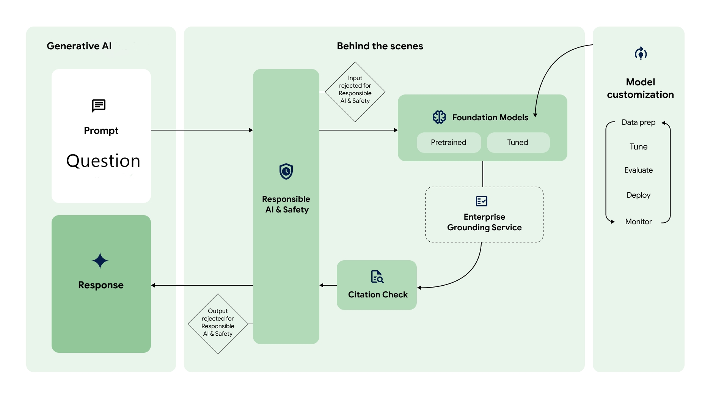

# WordWise

**WordWise** is a Python-based web application that leverages generative AI models from Google AI to solve mathematical word problems. It is designed to assist users in understanding and solving complex mathematical scenarios by providing detailed step-by-step solutions.

## Inspiration

The inspiration behind WordWise stems from the need to make mathematical problem-solving more accessible and intuitive. Traditional problem-solving methods can be challenging for many individuals, and WordWise aims to bridge that gap by harnessing the power of generative AI to simplify mathematical word problems.

## What it Does

WordWise specializes in solving mathematical word problems. Users can input a problem statement, and the application, powered by Google's generative AI models, provides comprehensive solutions, breaking down each step in a clear and understandable manner.

## How We Built It

WordWise is built using Python and the Flask web framework. It integrates with Google's generative AI models (`chat-bison-001` and `text-bison-001`) through the `palm` library. The user interface is crafted using HTML, and Flask handles the backend logic for processing user input and generating solutions.

## Challenges We Ran Into

- **Model Integration:** Integrating and configuring Google's AI models posed challenges, requiring careful consideration of API key management and model-specific nuances.

- **User Interface Design:** Creating an intuitive and user-friendly interface that seamlessly interacts with the backend AI models required iterative design and testing.

## Accomplishments That We're Proud Of

- Successful integration of Google's AI models for generating accurate and detailed solutions.

- Development of a clean and user-friendly web interface that enhances the user experience.

## What We Learned

- Enhanced understanding of generative AI models and their application in solving mathematical word problems.

- Improved proficiency in web development using Flask, HTML, and integrating external APIs.

## What's Next for WordWise

- **Enhanced Problem Types:** Expand the range of supported mathematical word problems and cater to various domains.

- **User Accounts and History:** Implement user accounts to track problem-solving history and provide personalized recommendations.

- **Feedback Mechanism:** Introduce a user feedback mechanism to continuously improve the accuracy and clarity of generated solutions.

- **Mobile Accessibility:** Optimize the application for mobile devices, ensuring a seamless experience on various platforms.

---

Feel free to customize each section further to add specific details about your project, team, and experiences.


## Features

- **Mathematical Word Problem Solver:** WordWise specializes in solving mathematical word problems, providing step-by-step solutions to user-input prompts.

- **Google AI Integration:** The application integrates with Google's generative AI models, including `chat-bison-001` and `text-bison-001`, tailored for generating messages and text, respectively.

- **User-Friendly Web Interface:** WordWise presents a user-friendly web interface where users can input their word problems and receive generated solutions.

## Setup and Configuration

1. **Install Dependencies:**
   ```bash
   pip install -r requirements.txt
   ```

2. **Google AI API Key:**
   Obtain your Google AI API key and configure it in the application:
   ```python
   palm.configure(api_key='YOUR_GOOGLE_API_KEY')
   ```

3. **Run the Application:**
   ```bash
   python app.py
   ```

   Visit `http://localhost:5000` in your web browser.

## Usage

1. Access the WordWise web interface.

2. Enter your mathematical word problem in the provided input field.

Example 1:

Question: The Flower Patch

In a garden, there are 5 rows of flowers. The first row has 4 flowers, and each subsequent row has 2 more flowers than the row above it. How many flowers are there in total?

Solution:

First row: 4 flowers.
Second row: 4 + 2 = 6 flowers.
Third row: 6 + 2 = 8 flowers.
Fourth row: 8 + 2 = 10 flowers.
Fifth row: 10 + 2 = 12 flowers.
Now, add up the flowers in each row: 4 + 6 + 8 + 10 + 12 = 40

Therefore, there are 40 flowers in total in the garden.

Example 2:

Question: The Toy Train

You have a toy train with three cars. In each car, there are 2 teddy bears, and the number of teddy bears doubles in each subsequent car. How many teddy bears are there in total?

Solution:

First car: 2 teddy bears.
Second car: 2 × 2 = 4
2×2=4 teddy bears.
Third car: 2 × 4 = 8
2×4=8 teddy bears.
Now, add up the teddy bears in each car: 2 + 4 + 8 = 14

Therefore, there are 14 teddy bears in total in the toy train.

3. Click the "Solve" button to generate a solution.

4. The application will display the step-by-step solution generated by Google's AI models.

## Workflow of Generative AI PaLM 2 for Text (text-bison)



## WebApp Preview


## Models Used

- **chat-bison-001:**
  - Supported Generation Methods: `generateMessage`, `countMessageTokens`

- **text-bison-001:**
  - Supported Generation Methods: `generateText`, `countTextTokens`, `createTunedTextModel`

- **embedding-gecko-001:**
  - Supported Generation Methods: `embedText`

## License

This project is licensed under the [MIT License](LICENSE).

## Acknowledgments

- **Google AI:** Special thanks to Google for providing access to their powerful generative AI models.

## Contributions

Contributions are welcome! Feel free to open issues or submit pull requests.

